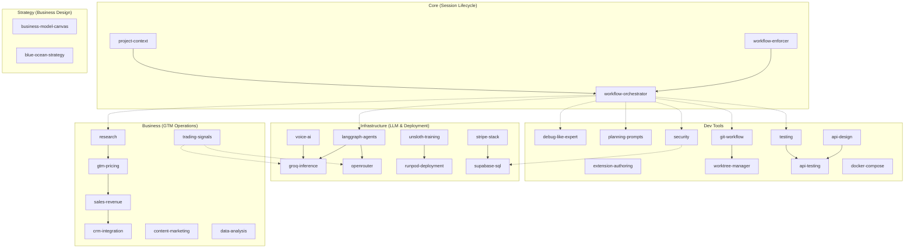

# Skill Dependency Graph

> Last validated: 2026-02-05
> Total skills: 30

Visual map of relationships between skills in this library. Enables skill discovery and understanding of how skills work together.

---

## 1. Visual Graph



### Legend

| Line Style | Meaning |
|------------|---------|
| `───────►` | Direct dependency (skill A requires skill B) |
| `- - - -►` | Routing dependency (orchestrator routes to skill) |

---

## 2. Cluster Table

| Cluster | Skills | Purpose |
|---------|--------|---------|
| **Core** | workflow-enforcer, project-context, workflow-orchestrator | Session lifecycle management |
| **Dev Tools** | extension-authoring, debug-like-expert, planning-prompts, worktree-manager, git-workflow, testing, api-design, security, api-testing, docker-compose | Development workflows |
| **Infrastructure** | langgraph-agents, groq-inference, openrouter, voice-ai, unsloth-training, runpod-deployment, supabase-sql, stripe-stack | LLM inference & deployment |
| **Business** | gtm-pricing, research, sales-revenue, crm-integration, content-marketing, data-analysis, trading-signals | GTM & revenue operations |
| **Strategy** | business-model-canvas, blue-ocean-strategy | Business model design |

### Count by Cluster

| Cluster | Count |
|---------|-------|
| Core | 3 |
| Dev Tools | 10 |
| Infrastructure | 8 |
| Business | 7 |
| Strategy | 2 |
| **Total** | **30** |

---

## 3. Load Order

Skills load in layers to minimize context usage:

| Layer | Skills | When Loaded |
|-------|--------|-------------|
| **L0** | workflow-enforcer | Always (session start) |
| **L1** | project-context | After working directory detected |
| **L2** | workflow-orchestrator | On "start day" or session init |
| **L3** | All others | On trigger match (lazy loading) |

### Progressive Disclosure

```
L0: YAML frontmatter only (all skills)
    ↓ trigger match
L1: SKILL.md content loaded
    ↓ deep dive needed
L2: reference/*.md files loaded on demand
```

---

## 4. Shared Tooling Patterns

Skills that share common technology stacks:

| Pattern | Skills Using It | Technology |
|---------|-----------------|------------|
| **LLM Stack** | langgraph-agents, openrouter, groq-inference, voice-ai, trading-signals | Claude, DeepSeek, Qwen, GROQ, Llama |
| **Database** | supabase-sql, security, stripe-stack | Supabase, PostgreSQL, RLS |
| **Testing** | testing, api-testing, security | Vitest, Jest, Postman, Bruno |
| **GTM/Sales** | gtm-pricing, sales-revenue, crm-integration, research | Close CRM, MEDDIC, BANT |
| **Deployment** | runpod-deployment, unsloth-training, docker-compose | RunPod, Docker, GPU serverless |
| **Voice** | voice-ai, groq-inference | Deepgram, Cartesia, Twilio |

---

## 5. Workflow Chains

Common sequences of skills used together:

### Session Lifecycle
```
workflow-enforcer → project-context → workflow-orchestrator
```

### Feature Development
```
planning-prompts → research → worktree-manager → testing → security → git-workflow
```

### LLM Training → Deployment
```
unsloth-training → runpod-deployment → [groq-inference | openrouter]
```

### Sales Pipeline
```
research → gtm-pricing → sales-revenue → crm-integration
```

### API Development
```
api-design → testing → api-testing → security
```

### Multi-Agent Systems
```
langgraph-agents → [openrouter | groq-inference] → voice-ai
```

---

## 6. Dependency Details

### Central Hub: workflow-orchestrator

The orchestrator routes to 13+ skills based on task type:

| Phase | Routes To |
|-------|-----------|
| START DAY | project-context, planning-prompts |
| RESEARCH | research, data-analysis |
| FEATURE DEV | testing, api-design, worktree-manager, git-workflow |
| DEBUG | debug-like-expert |
| END DAY | security, git-workflow |

### Explicit Cross-References

| From | To | Relationship |
|------|-----|--------------|
| groq-inference | voice-ai | STT/TTS provider |
| api-testing | testing | Test assertions |
| api-testing | api-design | Endpoint specs |
| stripe-stack | supabase-sql | Database patterns |
| langgraph-agents | openrouter | Model routing |
| langgraph-agents | groq-inference | Fast inference |
| trading-signals | openrouter | Chinese LLM stack |
| security | supabase-sql | RLS policies |

### Implicit Chains (Common Usage)

| Chain | Description |
|-------|-------------|
| Session | Enforcer validates → Context loads → Orchestrator routes |
| LLM Pipeline | Train with Unsloth → Deploy to RunPod → Serve via GROQ/OpenRouter |
| GTM | Research market → Set pricing → Execute sales → Track in CRM |
| API | Design spec → Write tests → Test endpoints → Security audit |

---

## 7. Orphan Skills

Skills with no explicit dependencies (standalone):

| Skill | Category | Notes |
|-------|----------|-------|
| extension-authoring | Dev Tools | Meta-skill for creating skills |
| content-marketing | Business | Standalone content creation |
| business-model-canvas | Strategy | Standalone framework |
| blue-ocean-strategy | Strategy | Standalone framework |
| docker-compose | Dev Tools | Local dev setup |
| data-analysis | Business | Can combine with any data source |

---

## 8. Maintenance Checklist

### When to Update This Graph

- [ ] Skill added or removed
- [ ] Cross-reference added between skills
- [ ] Orchestrator routing table changed
- [ ] Technology stack changed

### Validation Steps

```bash
# Verify skill count matches SKILLS_INDEX.md
grep -c "skill" SKILLS_INDEX.md  # Should mention 30

# Check Mermaid renders (paste into https://mermaid.live)

# Verify no broken links
grep -l "DEPENDENCY_GRAPH" *.md
```

### Last Validated

- **Date:** 2026-02-05
- **Skill Count:** 30 (2 stable, 28 active)
- **Mermaid:** Renders correctly
- **Cross-links:** SKILLS_INDEX.md, README.md

---

## See Also

- [SKILLS_INDEX.md](./SKILLS_INDEX.md) - Full skill documentation
- [README.md](./README.md) - Quick start guide
- [active/workflow-orchestrator-skill/](./active/workflow-orchestrator-skill/) - Central routing hub
