# Skill Dependency Graph

> Last validated: 2026-02-22
> Total skills: 39

Visual map of relationships between skills in this library. Enables skill discovery and understanding of how skills work together.

---

## 1. Visual Graph

```mermaid
graph TB
    subgraph Core["Core (Session Lifecycle)"]
        WE[workflow-enforcer-skill]
        PC[project-context]
        WO[workflow-orchestrator]
        CMT[cost-metering]
        PA[portfolio-artifact]
        WE --> WO
        PC --> WO
        WO --> CMT
        WO --> PA
        CMT --> PA
    end

    subgraph DevTools["Dev Tools"]
        EA[extension-authoring]
        DLE[debug-like-expert]
        PP[planning-prompts]
        WM[worktree-manager]
        GW[git-workflow]
        TS[testing]
        AD[api-design]
        SEC[security]
        AT[api-testing]
        DC[docker-compose]
        AT2[agent-teams]
        SAT[subagent-teams]
        ACM[agent-capability-matrix]
        HS[heal-skill]
        FUI[frontend-ui]

        AD --> AT
        TS --> AT
        GW --> WM
        WM --> AT2
        EA --> SAT
        AT2 --> SAT
        WO -.-> ACM
        EA --> HS
        FUI -.-> TS
        FUI -.-> AD
        FUI -.-> SEC
    end

    subgraph Infrastructure["Infrastructure (LLM & Deployment)"]
        LG[langgraph-agents]
        GI[groq-inference]
        OR[openrouter]
        VA[voice-ai]
        UN[unsloth-training]
        RP[runpod-deployment]
        SS[supabase-sql]
        ST[stripe-stack]

        LG --> OR
        LG --> GI
        VA --> GI
        UN --> RP
        ST --> SS
    end

    subgraph Business["Business (GTM Operations)"]
        RES[research]
        GTP[gtm-pricing]
        SR[sales-revenue]
        CRM[crm-integration]
        HR[hubspot-revops]
        CM[content-marketing]
        DA[data-analysis]
        TRD[trading-signals]
        MIRO[miro]

        RES --> GTP
        GTP --> SR
        SR --> CRM
        SR --> HR
        CRM --> HR
    end

    subgraph Strategy["Strategy (Business Design)"]
        BMC[business-model-canvas]
        BOS[blue-ocean-strategy]
    end

    %% Cross-cluster dependencies
    WO -.-> LG
    WO -.-> RES
    WO -.-> DLE
    WO -.-> PP
    WO -.-> TS
    WO -.-> SEC
    WO -.-> GW
    WO -.-> AT2
    WO -.-> SAT

    AT2 -.-> EA
    SEC -.-> SS
    TRD -.-> OR
    TRD -.-> GI
    MIRO -.-> BMC
    MIRO -.-> BOS
    MIRO -.-> GTP
    DA -.-> HR
    FUI -.-> ST
```



### Legend

| Line Style | Meaning |
|------------|---------|
| `───────►` | Direct dependency (skill A requires skill B) |
| `- - - -►` | Routing dependency (orchestrator routes to skill) |

---

## 2. Cluster Table

| Cluster | Skills | Purpose |
|---------|--------|---------|
| **Core** | workflow-enforcer-skill, project-context, workflow-orchestrator, cost-metering, portfolio-artifact | Session lifecycle management |
| **Dev Tools** | extension-authoring, debug-like-expert, planning-prompts, worktree-manager, git-workflow, testing, api-design, security, api-testing, docker-compose, agent-teams, subagent-teams, agent-capability-matrix, heal-skill, frontend-ui | Development workflows |
| **Infrastructure** | langgraph-agents, groq-inference, openrouter, voice-ai, unsloth-training, runpod-deployment, supabase-sql, stripe-stack | LLM inference & deployment |
| **Business** | gtm-pricing, research, sales-revenue, crm-integration, hubspot-revops, content-marketing, data-analysis, trading-signals, miro | GTM & revenue operations |
| **Strategy** | business-model-canvas, blue-ocean-strategy | Business model design |

### Count by Cluster

| Cluster | Count |
|---------|-------|
| Core | 5 |
| Dev Tools | 15 |
| Infrastructure | 8 |
| Business | 9 |
| Strategy | 2 |
| **Total** | **39** |

---

## 3. Load Order

Skills load in layers to minimize context usage:

| Layer | Skills | When Loaded |
|-------|--------|-------------|
| **L0** | workflow-enforcer-skill | Always (session start) |
| **L1** | project-context | After working directory detected |
| **L2** | workflow-orchestrator | On "start day" or session init |
| **L3** | All others | On trigger match (lazy loading) |

### Progressive Disclosure

```
L0: YAML frontmatter only (all skills)
    ↓ trigger match
L1: SKILL.md content loaded
    ↓ deep dive needed
L2: reference/*.md files loaded on demand
```

---

## 4. Shared Tooling Patterns

Skills that share common technology stacks:

| Pattern | Skills Using It | Technology |
|---------|-----------------|------------|
| **LLM Stack** | langgraph-agents, openrouter, groq-inference, voice-ai, trading-signals | Claude, DeepSeek, Qwen, GROQ, Llama |
| **Database** | supabase-sql, security, stripe-stack | Supabase, PostgreSQL, RLS |
| **Testing** | testing, api-testing, security | Vitest, Jest, Postman, Bruno |
| **GTM/Sales** | gtm-pricing, sales-revenue, crm-integration, hubspot-revops, research | Close CRM, HubSpot, MEDDIC, BANT |
| **Deployment** | runpod-deployment, unsloth-training, docker-compose | RunPod, Docker, GPU serverless |
| **Voice** | voice-ai, groq-inference | Deepgram, Cartesia, Twilio |

---

## 5. Workflow Chains

Common sequences of skills used together:

### Session Lifecycle
```
workflow-enforcer-skill → project-context → workflow-orchestrator
```

### Feature Development
```
planning-prompts → research → worktree-manager → testing → security → git-workflow
```

### LLM Training → Deployment
```
unsloth-training → runpod-deployment → [groq-inference | openrouter]
```

### Sales Pipeline
```
research → gtm-pricing → sales-revenue → crm-integration → hubspot-revops
```

### API Development
```
api-design → testing → api-testing → security
```

### Frontend Development
```
frontend-ui → [testing | api-design] → security → stripe-stack
```

### Multi-Agent Systems
```
langgraph-agents → [openrouter | groq-inference] → voice-ai
```

### Parallel Agent Development
```
planning-prompts → agent-teams → worktree-manager → [testing | git-workflow]
```

---

## 6. Dependency Details

### Central Hub: workflow-orchestrator

The orchestrator routes to 13+ skills based on task type:

| Phase | Routes To |
|-------|-----------|
| START DAY | project-context, planning-prompts, **Observer spawn** (agent-teams / subagent-teams) |
| RESEARCH | research, data-analysis |
| FEATURE DEV | testing, api-design, worktree-manager, git-workflow, **agent-teams, subagent-teams** |
| DEBUG | debug-like-expert |
| END DAY | security, git-workflow, **Observer final report** |

### Explicit Cross-References

| From | To | Relationship |
|------|-----|--------------|
| groq-inference | voice-ai | STT/TTS provider |
| api-testing | testing | Test assertions |
| api-testing | api-design | Endpoint specs |
| stripe-stack | supabase-sql | Database patterns |
| langgraph-agents | openrouter | Model routing |
| langgraph-agents | groq-inference | Fast inference |
| trading-signals | openrouter | Chinese LLM stack |
| security | supabase-sql | RLS policies |
| agent-teams | worktree-manager | Infrastructure (worktrees, ports, terminals) |
| agent-teams | extension-authoring | SKILL.md authoring patterns |
| subagent-teams | extension-authoring | Task tool patterns |
| subagent-teams | agent-teams | Team orchestration concepts |
| cost-metering | workflow-orchestrator | Cost gate integration |
| portfolio-artifact | workflow-orchestrator | End Day metrics capture |
| portfolio-artifact | cost-metering | Cost per feature metrics |
| miro | business-model-canvas | Canvas visualization |
| miro | blue-ocean-strategy | Strategy Canvas on Miro |
| miro | gtm-pricing | Pricing matrix boards |
| hubspot-revops | crm-integration | Base CRUD patterns |
| hubspot-revops | sales-revenue | Pipeline metrics, MEDDIC context |
| hubspot-revops | data-analysis | Visualization patterns |
| frontend-ui | testing | Component tests, accessibility audit |
| frontend-ui | api-design | API endpoint integration |
| frontend-ui | security | CSP, XSS prevention, auth UI |
| frontend-ui | stripe-stack | Pricing page, checkout UI |
| hubspot-revops | cost-metering | Enrichment cost tracking |

### Implicit Chains (Common Usage)

| Chain | Description |
|-------|-------------|
| Session | Enforcer validates → Context loads → Orchestrator routes |
| LLM Pipeline | Train with Unsloth → Deploy to RunPod → Serve via GROQ/OpenRouter |
| GTM | Research market → Set pricing → Execute sales → Track in CRM |
| API | Design spec → Write tests → Test endpoints → Security audit |

---

## 7. Orphan Skills

Skills with no explicit dependencies (standalone):

| Skill | Category | Notes |
|-------|----------|-------|
| extension-authoring | Dev Tools | Meta-skill for creating skills |
| content-marketing | Business | Standalone content creation |
| business-model-canvas | Strategy | Standalone framework |
| blue-ocean-strategy | Strategy | Standalone framework |
| docker-compose | Dev Tools | Local dev setup |
| data-analysis | Business | Can combine with any data source |

---

## 8. Maintenance Checklist

### When to Update This Graph

- [ ] Skill added or removed
- [ ] Cross-reference added between skills
- [ ] Orchestrator routing table changed
- [ ] Technology stack changed

### Validation Steps

```bash
# Verify skill count matches SKILLS_INDEX.md
grep -c "skill" SKILLS_INDEX.md  # Should mention 30

# Check Mermaid renders (paste into https://mermaid.live)

# Verify no broken links
grep -l "DEPENDENCY_GRAPH" *.md
```

### Last Validated

- **Date:** 2026-02-22
- **Skill Count:** 39 (2 stable, 37 active)
- **Mermaid:** Renders correctly
- **Cross-links:** SKILLS_INDEX.md, README.md

---

## See Also

- [SKILLS_INDEX.md](./SKILLS_INDEX.md) - Full skill documentation
- [README.md](./README.md) - Quick start guide
- [active/workflow-orchestrator-skill/](./active/workflow-orchestrator-skill/) - Central routing hub
