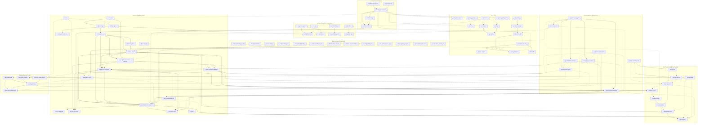

# Skill Dependency Graph

> Last validated: 2026-07-03
> Total skills: 82
> Naming note: `nooks-autopilot`, `sdr-dial-lists`, `sdr-call-coaching`, and `epiphan-call-playbook` deliberately omit the `-skill` suffix (live-automation names, P14 harvest).

Visual map of relationships between skills in this library. Enables skill discovery and understanding of how skills work together.

---

## 1. Visual Graph


```mermaid
graph TB
    subgraph Core["Core (Session Lifecycle)"]
        WE[workflow-enforcer-skill]
        PC[project-context]
        WO[workflow-orchestrator]
        CMT[cost-metering]
        PA[portfolio-artifact]
        WE --> WO
        PC --> WO
        WO --> CMT
        WO --> PA
        CMT --> PA
    end

    subgraph DevTools["Dev Tools"]
        EA[extension-authoring]
        DLE[debug-like-expert]
        PP[planning-prompts]
        WM[worktree-manager]
        GW[git-workflow]
        TS[testing]
        AD[api-design]
        SEC[security]
        AT[api-testing]
        DC[docker-compose]
        AT2[agent-teams]
        SAT[subagent-teams]
        ACM[agent-capability-matrix]
        HS[heal-skill]
        FUI[frontend-ui]

        AD --> AT
        TS --> AT
        GW --> WM
        WM --> AT2
        EA --> SAT
        AT2 --> SAT
        WO -.-> ACM
        EA --> HS
        FUI -.-> TS
        FUI -.-> AD
        FUI -.-> SEC
    end

    subgraph Infrastructure["Infrastructure (LLM & Deployment)"]
        LG[langgraph-agents]
        GI[groq-inference]
        OR[openrouter]
        VA[voice-ai]
        UN[unsloth-training]
        RP[runpod-deployment]
        SS[supabase-sql]
        ST[stripe-stack]

        LG --> OR
        LG --> GI
        VA --> GI
        UN --> RP
        ST --> SS
    end

    subgraph Business["Business (GTM Operations)"]
        RES[research]
        GTP[gtm-pricing]
        SR[sales-revenue]
        CRM[crm-integration]
        HR[hubspot-revops]
        CM[content-marketing]
        DA[data-analysis]
        TRD[trading-signals]
        MIRO[miro]
        PRC[prospect-research-to-cadence]
        PVW[phone-verification-waterfall]
        MCA[meddic-call-prep-auto]
        DMA[deal-momentum-analyzer]
        PDL[portfolio-deal-linker]
        AEH[ae-handoff-brief]
        CRA[call-recording-analyzer]
        DDR[dead-deal-recovery]
        TAS[trading-alert-scheduler]
        IBKR[ibkr-api]

        RES --> GTP
        GTP --> SR
        SR --> CRM
        SR --> HR
        CRM --> HR

        %% Automated deal flow chain
        SR --> PRC
        HR --> PRC
        RES --> PRC
        HR --> PVW
        PRC --> PVW
        PVW --> DMA
        PRC --> MCA
        SR --> MCA
        HR --> MCA
        HR --> DMA
        SR --> DMA
        MCA --> DMA
        PA --> DMA

        %% Portfolio attribution + trading
        DMA --> PDL
        PRC --> PDL
        MCA --> PDL
        PA --> PDL
        TRD --> TAS

        %% P13 Phase 4 promotions (ae-handoff, call-recording, dead-deal)
        DMA --> AEH
        MCA --> AEH
        CRA -.-> AEH
        CRA -.-> DMA
        CRA -.-> MCA
        MCA --> DDR
        DDR -.-> DMA
    end

    subgraph BDRAuto["BDR Automation (Daily Pipeline)"]
        PE[prospect-enrich]
        PR[prospect-refresh]
        SL[sequence-load]
        CLC[callable-lead-count]
        MB[morning-brief]
        HDQ[he-dial-queue]
        NAP[nooks-autopilot]
        SDL[sdr-dial-lists]
        SCC[sdr-call-coaching]

        PE --> PVW
        PE --> PR
        PR --> SL
        SL --> CLC
        CLC --> MB
        DMA --> MB
        HR --> PE
        HR --> CLC
        CRA -.-> MB
        DDR -.-> MB

        %% P14 harvest — dial queue + autopilot + SDR pod
        PVW --> HDQ
        HDQ -.-> CLC
        HDQ -.-> MB
        HDQ -.-> NAP
        SL --> NAP
        NAP -.-> PRC
        NAP -.-> PE
        NAP -.-> PVW
        NAP -.-> MB
        SDL -.-> SCC
        SDL -.-> NAP
        SCC -.-> NAP
    end

    subgraph SalesEnable["Sales Enablement (P14 Harvest)"]
        EMG[epiphan-ai-mcp-guide]
        BP[business-pulse]
        CPG[close-plan-generator]
        CDC[cost-discovery-coach]
        DEP[demo-execution-playbook]
        GFT[greenfield-pearl-tracker]
        ECP[epiphan-call-playbook]
        PDA[post-demo-automation]

        EMG --> BP
        EMG --> CPG
        EMG --> CDC
        EMG --> DEP
        EMG --> GFT
        MCA --> DEP
        BP -.-> SR
        BP -.-> MB
        CPG -.-> DMA
        CPG -.-> MCA
        CPG -.-> AEH
        DEP -.-> AEH
        DEP -.-> CRA
        GFT -.-> DMA
        GFT -.-> CDC
        PDA -.-> MCA
        PDA -.-> DMA
        PDA -.-> CPG
        PDA -.-> AEH
        ECP --> SDL
        ECP --> SCC
        ECP -.-> NAP
    end

    subgraph SalesIntel["Sales Intelligence (Imported)"]
        CI[champion-identifier]
        CESG[cold-email-sequence-gen]
        CH[contact-hunter]
        ETG[email-template-gen]
        ILQ[inbound-lead-qualifier]
        ISA[intent-signal-aggregator]
        LSNA[linkedin-sales-nav-alt]
        LCF[lookalike-customer-finder]
        MIS[meeting-intelligence]
        PAS[personalization-at-scale]
        PHA[pipeline-health-analyzer]
        SMI[sales-methodology-impl]
        SSCG[social-selling-content-gen]

        %% Sales Intelligence cross-refs
        PHA -.-> DMA
        SMI -.-> MCA
        CI -.-> PRC
        CESG -.-> PRC
        PAS -.-> PR
        LCF -.-> HR
        ISA -.-> DMA
    end

    subgraph Strategy["Strategy (Business Design)"]
        BMC[business-model-canvas]
        BOS[blue-ocean-strategy]
        JTBD[jobs-to-be-done]
        CS[challenger-sale]
        NSTTD[never-split-the-difference]
        JTBD --> CS
        JTBD --> NSTTD
        BOS --> CS
        BMC --> CS
        CS --> NSTTD
    end

    %% Cross-cluster dependencies
    WO -.-> LG
    WO -.-> RES
    WO -.-> DLE
    WO -.-> PP
    WO -.-> TS
    WO -.-> SEC
    WO -.-> GW
    WO -.-> AT2
    WO -.-> SAT

    AT2 -.-> EA
    SEC -.-> SS
    TRD -.-> OR
    TRD -.-> GI
    MIRO -.-> BMC
    MIRO -.-> BOS
    MIRO -.-> GTP
    DA -.-> HR
    FUI -.-> ST

    %% P13 Phase 4 cross-cluster
    PHA --> DDR
    DDR -.-> CS
    DDR -.-> NSTTD

    %% P14 Sales Enablement cross-cluster
    CS --> DEP
    CDC -.-> JTBD
    CDC -.-> NSTTD
    CDC -.-> CS
    PDA -.-> CS
    PDA -.-> NSTTD
    BP -.-> PHA
    GFT -.-> BOS
    EMG -.-> BOS
```

### Legend

| Line Style | Meaning |
|------------|---------|
| `───────►` | Direct dependency (skill A requires skill B) |
| `- - - -►` | Routing dependency (orchestrator routes to skill) |

---

## 2. Cluster Table

| Cluster | Skills | Purpose |
|---------|--------|---------|
| **Core** | workflow-enforcer-skill, project-context, workflow-orchestrator, cost-metering, portfolio-artifact | Session lifecycle management |
| **Dev Tools** | extension-authoring, debug-like-expert, planning-prompts, worktree-manager, git-workflow, testing, api-design, security, api-testing, docker-compose, agent-teams, subagent-teams, agent-capability-matrix, heal-skill, frontend-ui | Development workflows |
| **Infrastructure** | langgraph-agents, groq-inference, openrouter, voice-ai, unsloth-training, runpod-deployment, supabase-sql, stripe-stack | LLM inference & deployment |
| **Business** | gtm-pricing, research, sales-revenue, crm-integration, hubspot-revops, content-marketing, data-analysis, trading-signals, miro, prospect-research-to-cadence, phone-verification-waterfall, meddic-call-prep-auto, deal-momentum-analyzer, portfolio-deal-linker, trading-alert-scheduler, ibkr-api, ae-handoff-brief, call-recording-analyzer, dead-deal-recovery | GTM & revenue operations |
| **BDR Automation** | prospect-enrich, prospect-refresh, sequence-load, callable-lead-count, morning-brief, he-dial-queue, nooks-autopilot, sdr-dial-lists, sdr-call-coaching | Daily pipeline automation (scheduled Mon-Fri) + live SDR pod automation |
| **Sales Enablement** | epiphan-ai-mcp-guide, business-pulse, close-plan-generator, cost-discovery-coach, demo-execution-playbook, greenfield-pearl-tracker, epiphan-call-playbook, post-demo-automation | Epiphan AE/SDR enablement (P14 harvest; post-demo-automation is category "Sales Automation" in config) |
| **Sales Intelligence** | champion-identifier, cold-email-sequence-generator, contact-hunter, email-template-generator, inbound-lead-qualifier, intent-signal-aggregator, linkedin-sales-navigator-alt, lookalike-customer-finder, meeting-intelligence-system, personalization-at-scale, pipeline-health-analyzer, sales-methodology-implementer, social-selling-content-generator | Sales tooling (imported from Claude Desktop) |
| **Strategy** | business-model-canvas, blue-ocean-strategy, jobs-to-be-done, challenger-sale, never-split-the-difference | Business model design + innovation + sales methodology |

### Count by Cluster

| Cluster | Count |
|---------|-------|
| Core | 5 |
| Dev Tools | 15 |
| Infrastructure | 8 |
| Business | 19 |
| BDR Automation | 9 |
| Sales Enablement | 8 |
| Sales Intelligence | 13 |
| Strategy | 5 |
| **Total** | **82** |

---

## 3. Load Order

Skills load in layers to minimize context usage:

| Layer | Skills | When Loaded |
|-------|--------|-------------|
| **L0** | workflow-enforcer-skill | Always (session start) |
| **L1** | project-context | After working directory detected |
| **L2** | workflow-orchestrator | On "start day" or session init |
| **L3** | All others | On trigger match (lazy loading) |

### Progressive Disclosure

```
L0: YAML frontmatter only (all skills)
    ↓ trigger match
L1: SKILL.md content loaded
    ↓ deep dive needed
L2: reference/*.md files loaded on demand
```

---

## 4. Shared Tooling Patterns

Skills that share common technology stacks:

| Pattern | Skills Using It | Technology |
|---------|-----------------|------------|
| **LLM Stack** | langgraph-agents, openrouter, groq-inference, voice-ai, trading-signals | Claude, DeepSeek, Qwen, GROQ, Llama |
| **Database** | supabase-sql, security, stripe-stack | Supabase, PostgreSQL, RLS |
| **Testing** | testing, api-testing, security | Vitest, Jest, Postman, Bruno |
| **GTM/Sales** | gtm-pricing, sales-revenue, crm-integration, hubspot-revops, research | Close CRM, HubSpot, MEDDIC, BANT |
| **Deployment** | runpod-deployment, unsloth-training, docker-compose | RunPod, Docker, GPU serverless |
| **Voice** | voice-ai, groq-inference | Deepgram, Cartesia, Twilio |

---

## 5. Workflow Chains

Common sequences of skills used together:

### Session Lifecycle
```
workflow-enforcer-skill → project-context → workflow-orchestrator
```

### Feature Development
```
planning-prompts → research → worktree-manager → testing → security → git-workflow
```

### LLM Training → Deployment
```
unsloth-training → runpod-deployment → [groq-inference | openrouter]
```

### Sales Pipeline
```
research → gtm-pricing → sales-revenue → crm-integration → hubspot-revops
```

### BDR Daily Pipeline (Monday Full Chain)
```
06:00 prospect-enrich → 06:15 phone-waterfall → 06:30 prospect-refresh → 07:15 sequence-load
                                                                                    ↓
07:00 deal-momentum ──────────────────────────────────────────────────► 07:25 callable-lead-count → 07:30 morning-brief
07:00 portfolio-linker ─────────────────────────────────────────────────────────────────────────────────────↗
07:00 trading-alerts ───────────────────────────────────────────────────────────────────────────────────────↗
```

### Automated Deal Flow
```
prospect-research-to-cadence → phone-verification-waterfall → meddic-call-prep-auto → deal-momentum-analyzer → portfolio-deal-linker
         ↑                            ↑                            ↑                         ↑                        ↑
   [Apollo + Epiphan CRM]    [Apollo + Clay]        [Clari + Calendar]        [HubSpot + Clari]         [Attribution engine]
```

### Trading Alerts (Standalone)
```
trading-signals + ibkr-api → trading-alert-scheduler
                             (scheduled daily 7am CST — pre-market digest)
```

### API Development
```
api-design → testing → api-testing → security
```

### Frontend Development
```
frontend-ui → [testing | api-design] → security → stripe-stack
```

### Multi-Agent Systems
```
langgraph-agents → [openrouter | groq-inference] → voice-ai
```

### Parallel Agent Development
```
planning-prompts → agent-teams → worktree-manager → [testing | git-workflow]
```

---

## 6. Dependency Details

### Central Hub: workflow-orchestrator

The orchestrator routes to 13+ skills based on task type:

| Phase | Routes To |
|-------|-----------|
| START DAY | project-context, planning-prompts, **Observer spawn** (agent-teams / subagent-teams) |
| RESEARCH | research, data-analysis |
| FEATURE DEV | testing, api-design, worktree-manager, git-workflow, **agent-teams, subagent-teams** |
| DEBUG | debug-like-expert |
| END DAY | security, git-workflow, **Observer final report** |

### Explicit Cross-References

| From | To | Relationship |
|------|-----|--------------|
| groq-inference | voice-ai | STT/TTS provider |
| api-testing | testing | Test assertions |
| api-testing | api-design | Endpoint specs |
| stripe-stack | supabase-sql | Database patterns |
| langgraph-agents | openrouter | Model routing |
| langgraph-agents | groq-inference | Fast inference |
| trading-signals | openrouter | Chinese LLM stack |
| security | supabase-sql | RLS policies |
| agent-teams | worktree-manager | Infrastructure (worktrees, ports, terminals) |
| agent-teams | extension-authoring | SKILL.md authoring patterns |
| subagent-teams | extension-authoring | Task tool patterns |
| subagent-teams | agent-teams | Team orchestration concepts |
| cost-metering | workflow-orchestrator | Cost gate integration |
| portfolio-artifact | workflow-orchestrator | End Day metrics capture |
| portfolio-artifact | cost-metering | Cost per feature metrics |
| miro | business-model-canvas | Canvas visualization |
| miro | blue-ocean-strategy | Strategy Canvas on Miro |
| miro | gtm-pricing | Pricing matrix boards |
| hubspot-revops | crm-integration | Base CRUD patterns |
| hubspot-revops | sales-revenue | Pipeline metrics, MEDDIC context |
| hubspot-revops | data-analysis | Visualization patterns |
| frontend-ui | testing | Component tests, accessibility audit |
| frontend-ui | api-design | API endpoint integration |
| frontend-ui | security | CSP, XSS prevention, auth UI |
| frontend-ui | stripe-stack | Pricing page, checkout UI |
| hubspot-revops | cost-metering | Enrichment cost tracking |
| prospect-research-to-cadence | sales-revenue | Email templates, MEDDIC framework |
| prospect-research-to-cadence | hubspot-revops | Golden Rules filter, HubSpot queries |
| prospect-research-to-cadence | research | Firmographic research patterns |
| meddic-call-prep-auto | sales-revenue | MEDDIC framework, objection handling |
| meddic-call-prep-auto | prospect-research-to-cadence | Enrichment logic, Golden Rules |
| deal-momentum-analyzer | hubspot-revops | HubSpot query patterns, stage definitions |
| deal-momentum-analyzer | meddic-call-prep-auto | Call prep for recovery actions |
| deal-momentum-analyzer | portfolio-artifact | Deal recovery metrics for GTME portfolio |
| ae-handoff-brief | deal-momentum-analyzer | Deal health context for AE |
| ae-handoff-brief | meddic-call-prep-auto | Shared MEDDIC synthesis logic |
| ae-handoff-brief | call-recording-analyzer | Call-by-call MEDDIC scores + coaching data |
| call-recording-analyzer | deal-momentum-analyzer | Feeds Signal 4 (call momentum) |
| call-recording-analyzer | morning-brief | Yesterday's call scores + unresolved actions |
| call-recording-analyzer | meddic-call-prep-auto | Prior call gaps inform next prep |
| dead-deal-recovery | deal-momentum-analyzer | Shares deal health scoring (RED deals go deeper) |
| dead-deal-recovery | meddic-call-prep-auto | Recovery call MEDDIC prep |
| dead-deal-recovery | morning-brief | Daily stall threshold alerts |
| portfolio-deal-linker | portfolio-artifact | Base metrics + weekly digest format |
| portfolio-deal-linker | deal-momentum-analyzer | Recovery attribution (RED/YELLOW → won) |
| portfolio-deal-linker | prospect-research-to-cadence | Origination attribution (Apollo sequences) |
| portfolio-deal-linker | meddic-call-prep-auto | Influence attribution (call prep generated) |
| portfolio-deal-linker | hubspot-revops | HubSpot deal queries |
| phone-verification-waterfall | hubspot-revops | Phone-less contacts query |
| phone-verification-waterfall | prospect-research-to-cadence | Shares Golden Rules, enrichment logic |
| phone-verification-waterfall | deal-momentum-analyzer | Feeds callable leads for recovery calls |
| trading-alert-scheduler | trading-signals | Core analysis framework (regime, 5 methodologies) |
| trading-alert-scheduler | ibkr-api | Portfolio positions, P&L, margin |
| business-pulse | epiphan-ai-mcp-guide | MCP tool defaults + query patterns |
| business-pulse | pipeline-health-analyzer / sales-revenue / morning-brief | Pulse metrics feed briefs + analytics |
| close-plan-generator | epiphan-ai-mcp-guide | Deal/contact data pulls |
| close-plan-generator | deal-momentum-analyzer / meddic-call-prep-auto / ae-handoff-brief | MEDDIC + momentum context for close plans |
| cost-discovery-coach | epiphan-ai-mcp-guide | Calculator inputs via MCP |
| cost-discovery-coach | jobs-to-be-done / never-split-the-difference / challenger-sale / greenfield-pearl-tracker | Question frameworks per vertical |
| demo-execution-playbook | epiphan-ai-mcp-guide / meddic-call-prep-auto / challenger-sale | Demo prep inputs (depends_on) |
| demo-execution-playbook | ae-handoff-brief / call-recording-analyzer | Demo flow handoff + post-demo scoring |
| greenfield-pearl-tracker | epiphan-ai-mcp-guide | CRM + Clari signal queries |
| greenfield-pearl-tracker | deal-momentum-analyzer / cost-discovery-coach / blue-ocean-strategy | Opportunity scoring + discovery |
| epiphan-ai-mcp-guide | business-pulse / greenfield-pearl-tracker / blue-ocean-strategy / morning-brief / sales-revenue | Day-one MCP reference hub |
| epiphan-call-playbook | sdr-dial-lists / sdr-call-coaching / nooks-autopilot | Canonical scripts + Verified Spec Bank |
| post-demo-automation | meddic-call-prep-auto / deal-momentum-analyzer / challenger-sale / never-split-the-difference / close-plan-generator / ae-handoff-brief | 5-touch momentum plan + debrief notes |
| he-dial-queue | phone-verification-waterfall | Verified-phone pool (depends_on) |
| he-dial-queue | morning-brief / callable-lead-count / nooks-autopilot | Tiered queue feeds daily workflow |
| nooks-autopilot | sequence-load | Sequence enrollment engine (depends_on) |
| nooks-autopilot | prospect-research-to-cadence / prospect-enrich / phone-verification-waterfall / morning-brief | Qualification + sourcing + warm handoffs |
| sdr-dial-lists | epiphan-call-playbook | Talking points source (depends_on) |
| sdr-dial-lists | sdr-call-coaching / nooks-autopilot | Queue ↔ coaching loop |
| sdr-call-coaching | epiphan-call-playbook | Scoring rubric reference (depends_on) |
| sdr-call-coaching | sdr-dial-lists / nooks-autopilot | Coaching cards ↔ dial performance |

### Implicit Chains (Common Usage)

| Chain | Description |
|-------|-------------|
| Session | Enforcer validates → Context loads → Orchestrator routes |
| LLM Pipeline | Train with Unsloth → Deploy to RunPod → Serve via GROQ/OpenRouter |
| GTM | Research market → Set pricing → Execute sales → Track in CRM |
| API | Design spec → Write tests → Test endpoints → Security audit |

---

## 7. Orphan Skills

Skills with no explicit dependencies (standalone):

| Skill | Category | Notes |
|-------|----------|-------|
| extension-authoring | Dev Tools | Meta-skill for creating skills |
| content-marketing | Business | Standalone content creation |
| business-model-canvas | Strategy | Standalone framework |
| blue-ocean-strategy | Strategy | Standalone framework |
| jobs-to-be-done | Strategy | Standalone framework |
| challenger-sale | Strategy | Teach-Tailor-Take Control methodology |
| never-split-the-difference | Strategy | FBI negotiation framework |
| docker-compose | Dev Tools | Local dev setup |
| data-analysis | Business | Can combine with any data source |

---

## 8. Maintenance Checklist

### When to Update This Graph

- [ ] Skill added or removed
- [ ] Cross-reference added between skills
- [ ] Orchestrator routing table changed
- [ ] Technology stack changed

### Validation Steps

```bash
# Verify skill count matches SKILLS_INDEX.md
grep -c "skill" SKILLS_INDEX.md  # Should mention 30

# Check Mermaid renders (paste into https://mermaid.live)

# Verify no broken links
grep -l "DEPENDENCY_GRAPH" *.md
```

### Last Validated

- **Date:** 2026-07-03
- **Skill Count:** 82 (2 stable, 80 active) — verified via `ls active/ stable/`
- **Changes:** Added edges for 3 P13 Phase 4 promotions (ae-handoff-brief, call-recording-analyzer, dead-deal-recovery) + 12 P14 harvest skills (Sales Enablement subgraph + 4 BDR Automation additions)
- **Mermaid:** Renders correctly
- **Cross-links:** SKILLS_INDEX.md, README.md

---

## See Also

- [SKILLS_INDEX.md](./SKILLS_INDEX.md) - Full skill documentation
- [README.md](./README.md) - Quick start guide
- [active/workflow-orchestrator-skill/](./active/workflow-orchestrator-skill/) - Central routing hub
